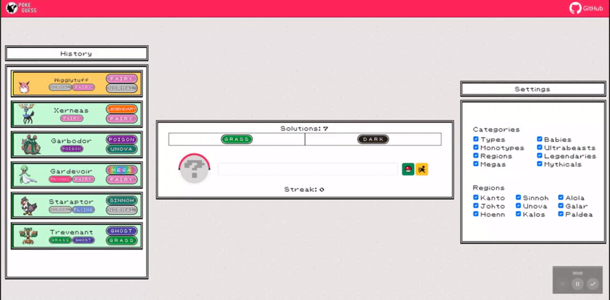

  

# Introduction

Welcome to PokeGuess, the ultimate web-based, open-source Pokémon guessing game that challenges both casual fans and seasoned trainers! Test your knowledge by matching a Pokémon to unique combinations of types and categories. Tailor your personal experience by choosing which categories and regions to play with.

## Game Preview

## Notice

- This project is open source under the GPLv3 license.
- PokeGuess is in no way affiliated with The Pokémon Company, Nintendo, Game Freak, Creatues Inc., or any of their subsidiaries.
